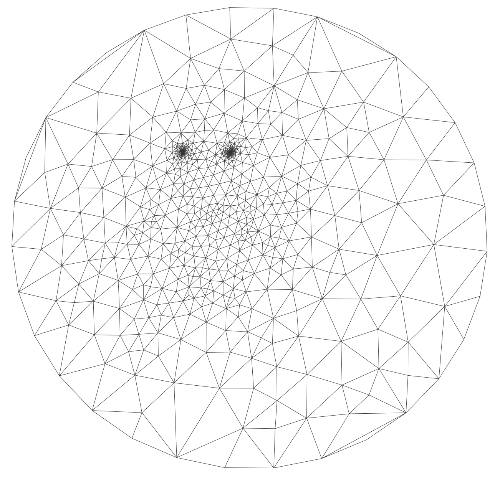
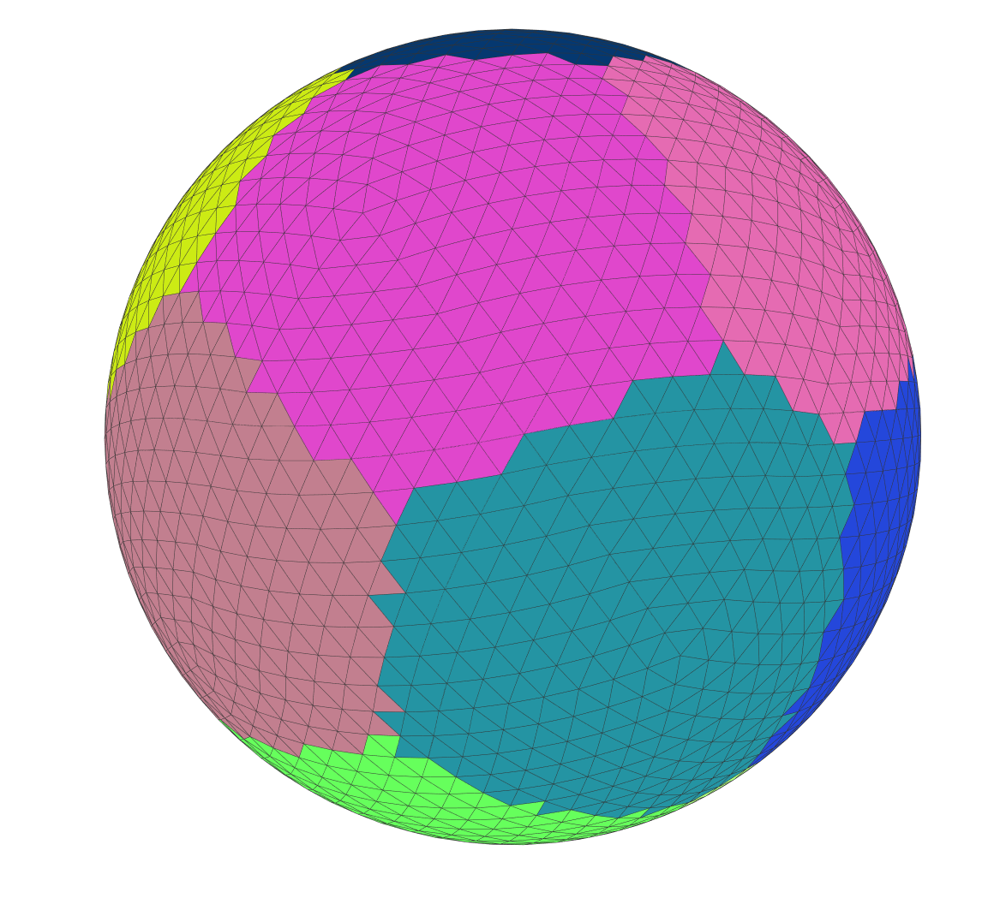

## 01 . Shortest path (Dijkstra’s algorithm) and minimal spanning tree on the triangular mesh

## 02 .  Curvature visualization

    

​                                                mean curvature                                                              gaussian curvature

## 03 . Mesh smoothing

  

​                           before                                                                  after

## 04 . Tutte embedding

  

## 05 . As rigid as possible mesh parameterization

   

## 06 . Mesh deformation

## 07 . Mean value coordinate parameterization

   

​               Tutte mesh parameterization                                                mean value coordinate parameterization

## 08 . Mesh interpolation

## 09 . Mesh simplification

##  

## 10 .  Lloyd Iteration

  

## 11 . Remeshing

  

## 12 . Delaunay triangulation

​																				before

 

​																					after

## 13 . Cross field

##  

